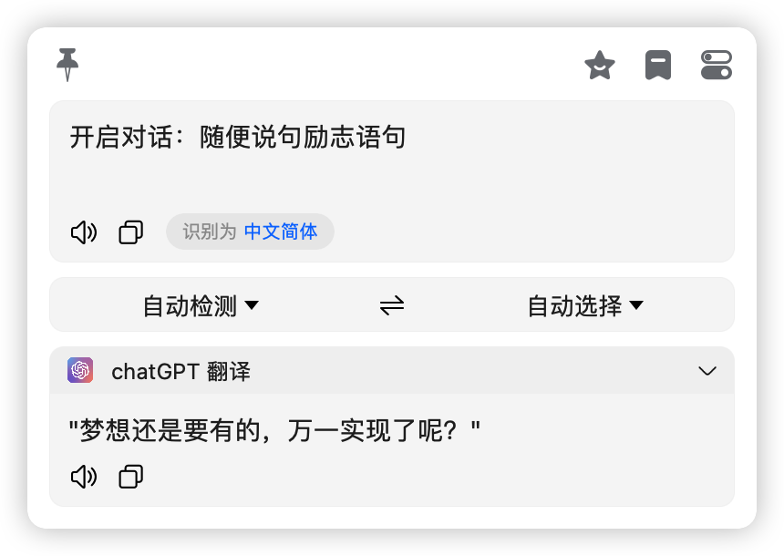
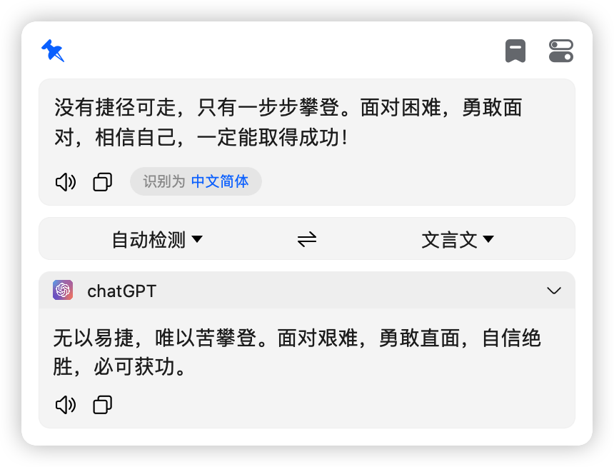
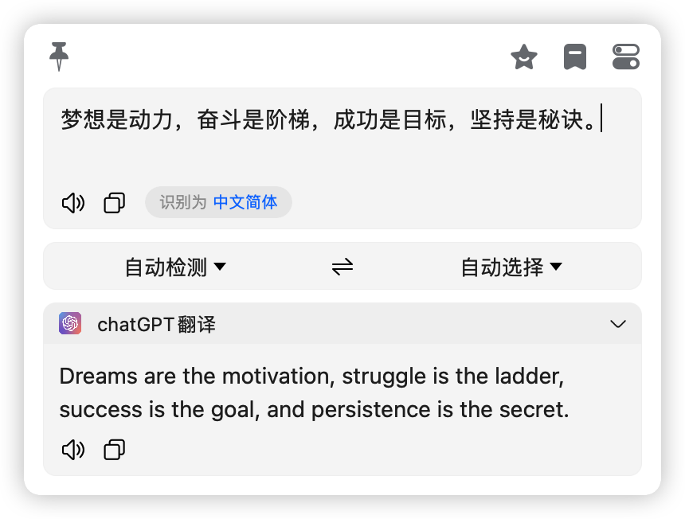
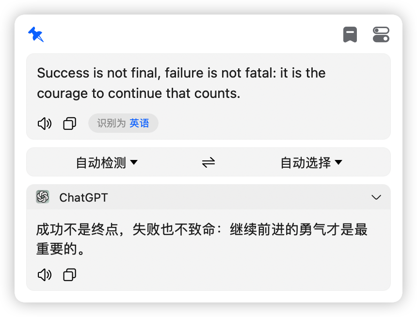

# 免费使用 chatGPT 进行翻译或无记忆对话

## 无需秘钥，免翻可用，可以直接在 bob 中进行工作，如果有一天它不工作了，请联系我进行修复！

> 插件下载地址：[bob-plugin-free-chatgpt-translate-v0.0.1.bobplugin](https://github.com/bilibili-ayang/bob-plugin-free-chatgpt-translate/releases/download/v0.0.1/bob-plugin-free-chatgpt-translate.bobplugin)
>
> 如果你想要进行无记忆对话，请在内容最前面写入 开启对话：
>
> 注意 ：为中文

### bob 翻译插件大合集:

> [小牛翻译插件(免秘钥)](https://github.com/bilibili-ayang/bob-plugin-free-calf-translate)

> [阿里翻译插件(免秘钥)](https://github.com/bilibili-ayang/bob-plugin-free-ali-translate)

> [chatGPT 翻译插件(免秘钥，免翻)](https://github.com/bilibili-ayang/bob-plugin-free-chatgpt-translate)

### 使用截图如下：

