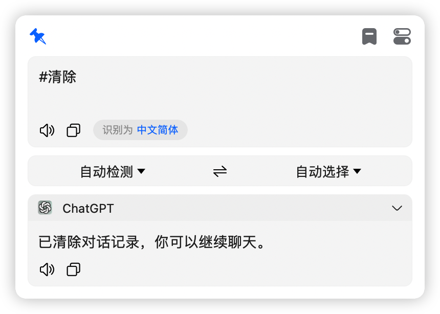
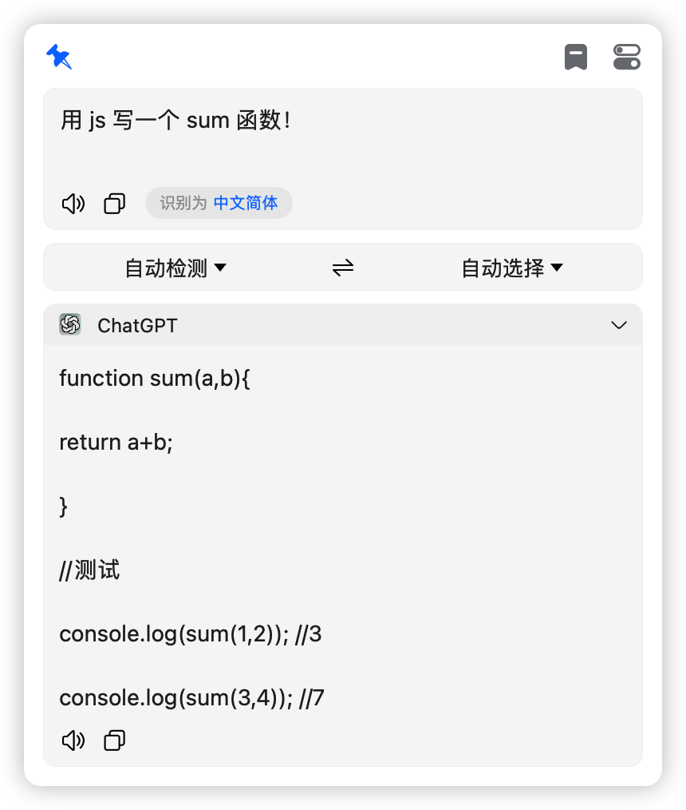
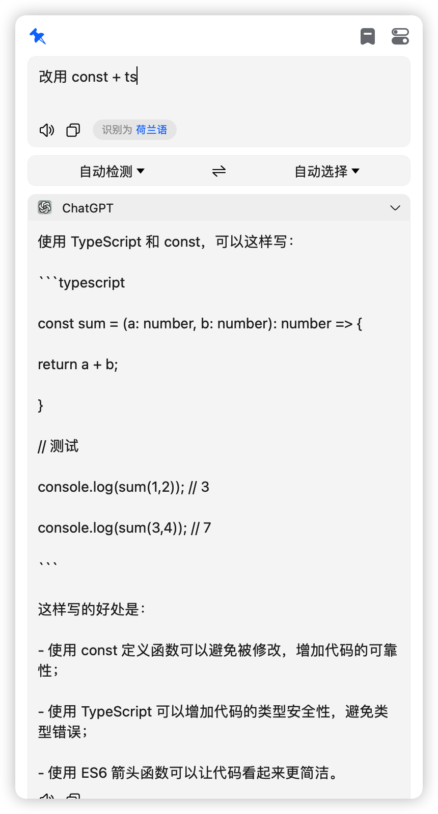

# 使用 GPT-3.5-turbo 进行记忆对话或翻译

## 无需秘钥，免翻可用，可以直接在 bob 中进行工作，如果有一天它不工作了，请联系我进行修复！

> 主要为 bob 用户开发，bob 是一款 macOS 上的翻译软件，官网地址：[bob](https://bobtranslate.com/)
>
> 插件下载地址：[bob-plugin-free-chatgpt-v0.1.1.bobplugin](https://github.com/bilibili-ayang/bob-plugin-free-chatgpt/releases/download/v0.1.1/bob-plugin-free-chatgpt.bobplugin)

### bob 插件大合集:

> [必应翻译插件(免秘钥)](https://github.com/bilibili-ayang/bob-plugin-free-bing-translate)

> [百度翻译插件(免秘钥)](https://github.com/bilibili-ayang/bob-plugin-free-baidu-translate)

> [小牛翻译插件(免秘钥)](https://github.com/bilibili-ayang/bob-plugin-free-calf-translate)

> [阿里翻译插件(免秘钥)](https://github.com/bilibili-ayang/bob-plugin-free-ali-translate)

> [搜狗翻译插件(免秘钥)](https://github.com/bilibili-ayang/bob-plugin-free-sougou-translate)

> [爱词霸翻译插件(免秘钥)](https://github.com/bilibili-ayang/bob-plugin-free-iciba-translate)

> [chatGPT 插件(免秘钥，免翻)](https://github.com/bilibili-ayang/bob-plugin-free-chatgpt)

### 如何使用？

注意：默认为翻译模式

> 可用指令：`#模式 #切换 #清除`
>
> #模式：查看当前模式
>
> #切换：切换模式
>
> #清除：清除对话历史记录

### 指令使用截图如下：

 
 
 

### 对话模式截图如下

### 翻译模式截图如下

