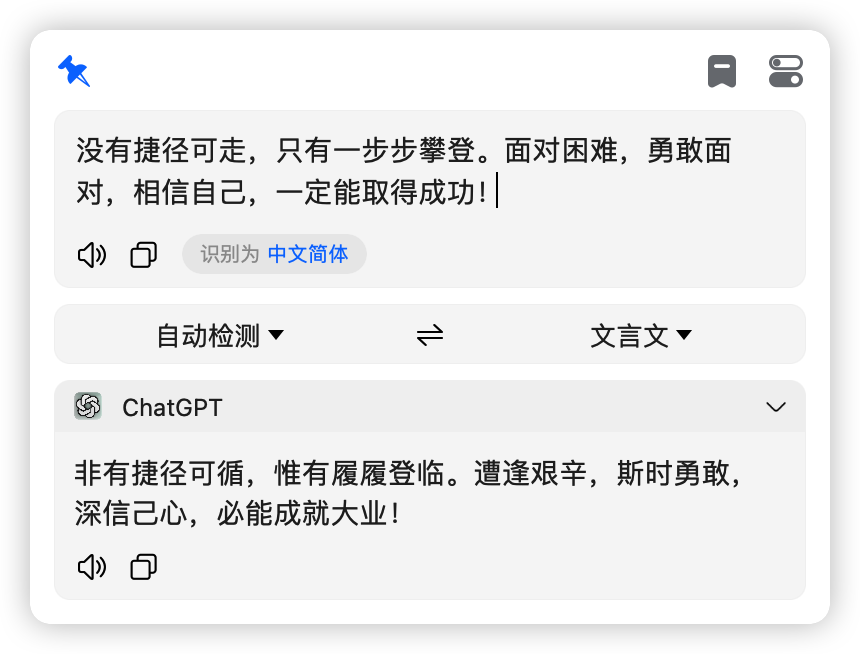
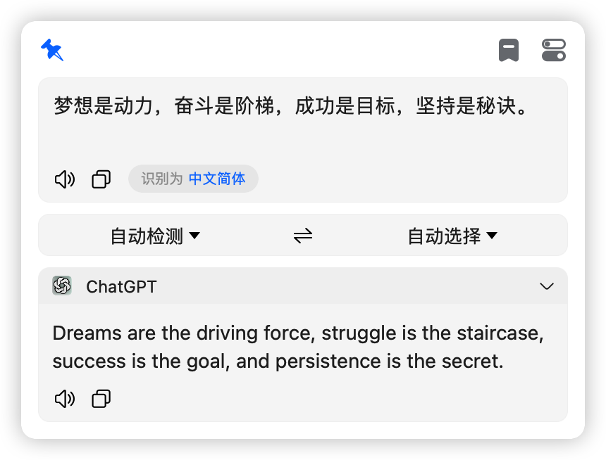

# 免费使用 chatGPT 进行对话(无记忆和记忆都支持)或翻译

## 无需秘钥，免翻可用，可以直接在 bob 中进行工作，如果有一天它不工作了，请联系我进行修复！

> 插件下载地址：[bob-plugin-free-chatgpt-v0.0.1.bobplugin](https://github.com/bilibili-ayang/bob-plugin-free-chatgpt/releases/download/v0.0.1/bob-plugin-free-chatgpt.bobplugin)

### bob 插件大合集:

> [必应翻译插件(免秘钥)](https://github.com/bilibili-ayang/bob-plugin-free-bing-translate)

> [小牛翻译插件(免秘钥)](https://github.com/bilibili-ayang/bob-plugin-free-calf-translate)

> [阿里翻译插件(免秘钥)](https://github.com/bilibili-ayang/bob-plugin-free-ali-translate)

> [chatGPT 插件(免秘钥，免翻)](https://github.com/bilibili-ayang/bob-plugin-free-chatgpt)

### 对话使用截图如下：

> 可用指令：`开启对话 结束对话 清除对话 开启无记忆对话 结束无记忆对话`
>
> 任意一个结束对话指令都可以切换到翻译模式，默认为翻译模式

#### 记忆对话：

 
 
 
 
 

#### 无记忆对话：

 
 
 

### 翻译使用截图如下

